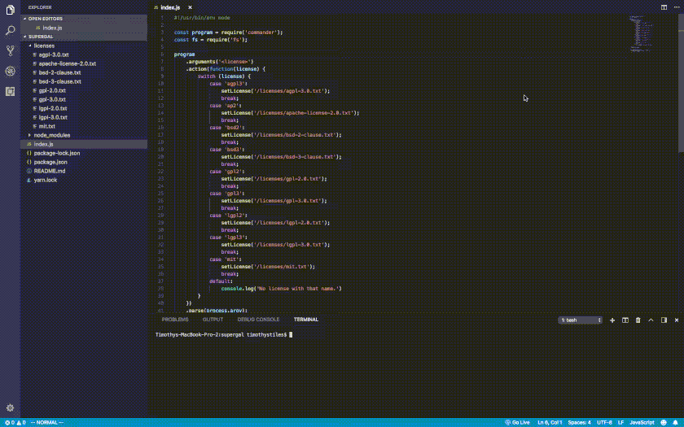

# supergal
Super Get a License - generates licenses from the command line.


## installation

```
npm install -g supergal
```

or

```
yarn install supergal
```

## usage


```
supergal <license> 
```

For example if you wanted to use the MIT license:
```
supergal mit
```

## building

To build your own local version do the following.

```
git clone 
```
```
cd supergal
```
```
npm run build
```
## contributing
Please make a fork, and branch to work on new features. Pull request to merge.

Feel free to add a template for your favorite license, add documentation, templating for custom names, pretty up the command line interface, add tests, or whatever you want! All pull requests considered.

## license

Copyright 2018 Timothy Stiles

Licensed under the Apache License, Version 2.0 (the "License");
you may not use this file except in compliance with the License.
You may obtain a copy of the License at

    http://www.apache.org/licenses/LICENSE-2.0

Unless required by applicable law or agreed to in writing, software
distributed under the License is distributed on an "AS IS" BASIS,
WITHOUT WARRANTIES OR CONDITIONS OF ANY KIND, either express or implied.
See the License for the specific language governing permissions and
limitations under the License.